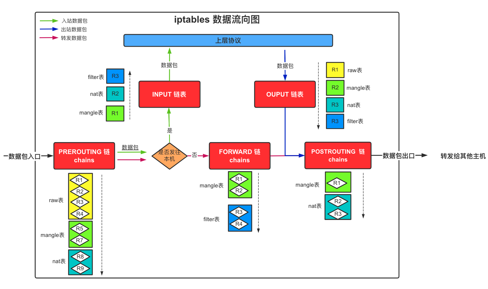

# iptables

# 一、简介


# 二、基础知识

## 1、iptables和netfilter的关系

**iptables**其实不是真正的防火墙，我们可以把它理解成一个客户端代理，用户通过iptables这个代理，将用户的安全设定执行到对应的"安全框架"中，这个"安全框架"才是真正的防火墙，这个框架的名字叫**netfilter**。netfilter才是防火墙真正的安全框架（framework），netfilter位于内核空间。

iptables其实是一个命令行工具，位于用户空间，我们用这个工具操作真正的框架。

 netfilter/iptables（下文中简称为iptables）组成Linux平台下的包过滤防火墙，与大多数的Linux软件一样，这个包过滤防火墙是免费的，它可以代替昂贵的商业防火墙解决方案，完成封包过滤、封包重定向和网络地址转换（NAT）等功能。


Netfilter是Linux操作系统核心层内部的一个数据包处理模块，它具有如下功能：

- 网络地址转换(Network Address Translate)

- 数据包内容修改
- 数据包过滤的防火墙功能

## 2、iptables传输数据包的过程

① 当一个数据包进入网卡时，它首先进入PREROUTING链，内核根据数据包目的IP判断是否需要转送出去。

② 如果数据包就是进入本机的，它就会沿着图向下移动，到达INPUT链。数据包到了INPUT链后，任何进程都会收到它。本机上运行的程序可以发送数据包，这些数据包会经过OUTPUT链，然后到达POSTROUTING链输出。

③ 如果数据包是要转发出去的，且内核允许转发，数据包就会如图所示向右移动，经过FORWARD链，然后到达POSTROUTING链输出。





报文的流向：

- **到本机某进程的报文**：PREROUTING --> INPUT

- **由本机转发的报文**：PREROUTING --> FORWARD --> POSTROUTING

- **由本机的某进程发出报文（通常为响应报文）**：OUTPUT --> POSTROUTING

## 3、内置链

- PREROUTING
- INPUT
- FORWARD
- OUTPUT
- POSTROUTING

## 4、内置表

- **filter表**：负责过滤功能，防火墙；**内核模块**：iptables_filter
- **nat表**：网络地址转换功能；**内核模块**：iptable_nat
- **mangle表**：拆解报文，做出修改，并重新封装的功能；**内核模块**：iptable_mangle
- **raw表**：关闭nat表上启用的连接追踪机制；**内核模块**：iptable_raw

## 5、处理动作

动作也可以分为基本动作和扩展动作

- **ACCEPT**：允许数据包通过。

- **DROP**：直接丢弃数据包，不给任何回应信息，这时候客户端会感觉自己的请求泥牛入海了，过了超时时间才会有反应。

- **REJECT**：拒绝数据包通过，必要时会给数据发送端一个响应的信息，客户端刚请求就会收到拒绝的信息。

- **SNAT**：源地址转换，解决内网用户用同一个公网地址上网的问题。

- **MASQUERADE**：是SNAT的一种特殊形式，适用于动态的、临时会变的ip上。

- **DNAT**：目标地址转换。

- **REDIRECT**：在本机做端口映射。

- **LOG**：在/var/log/messages文件中记录日志信息，然后将数据包传递给下一条规则，也就是说除了记录以外不对数据包做任何其他操作，仍然让下一条规则去匹配。

# 三、iptables语法格式

>  iptables [-t 表名] 命令选项 ［链名］ ［条件匹配］ ［-j 目标动作或跳转］


## 1、查看规则

```bash
# 查看表中的规则
iptables -L -t filter

# 查看链中的规则
iptables -L INPUT
iptables -L FORWARD --line-numbers 
```

## 2、删除规则

```bash
# 删除所有的规则
iptables -F
# 删除链中指定的规则
iptables -D FORWARD 1
```

## 3、添加规则

```bash
# 向链中添加规则
iptables -A FORWARD -s 10.8.0.10 -d 192.168.1.5 -j DROP
iptables -I FORWARD -s 10.8.0.10 -d 192.168.1.5 -j DROP
```


# 参考

1. https://www.jianshu.com/p/ee4ee15d3658
2. http://www.zsythink.net/archives/1199/