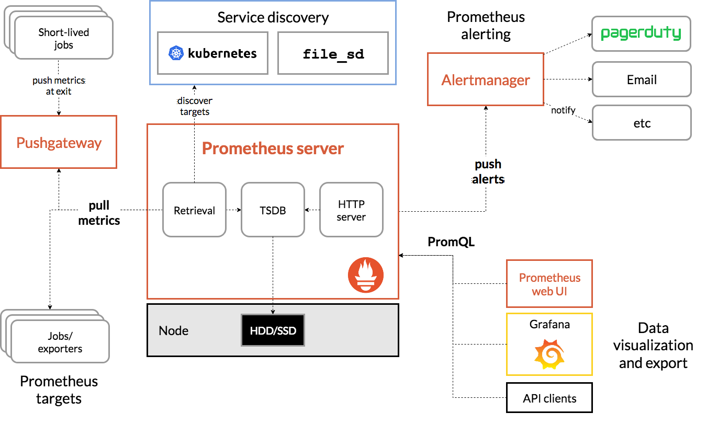

# Prometheus基础概念

# 一、简介

1. prometheus 是一个开源的系统监控和告警的工具包，其采用pull方式采集时间序列，通过http协议传输。

2. prometheus的优势在于，它是一个基于服务的告警系统，针对不同的服务，有不同的exporter，可以实现不一样的效果。

3. 最初由SoundCloud发布。它通过HTTP协议从远程的机器收集数据并存储在本地的时序数据库上。它提供了一个简单的网页界面、一个功能强大的查询语言以及HTTP接口等等。

4. Prometheus可以通过安装在远程机器上的exporter来收集监控数据。

官网：https://prometheus.io/ 
Github：https://github.com/prometheus/prometheus

# 二、架构



- **prometheus的核心是一个时间序列数据库，我们可以通过它抓取并存储数据，并通过prometheus定义的一些查询语句来获取我们需要的数据**
- **exporter的核心是一个静态web，通过不断更新的静态web暴露metric值**
- **alertmanager是一个报警接口，接收prometheus推送的告警，并通过自己定义的一些规则去进行告警**
- **Pushgateway 程序，主要是实现接收由Client push过来的指标数据，在指定的时间间隔，由主程序来抓取**

# 三、数据模型

Prometheus 中存储的数据为时间序列，是由 metric 的名字和一系列的标签（键值对）唯一标识的，不同的标签则代表不同的时间序列

- **metric** ：该名字应该具有语义，一般用于表示 metric 的功能，例如：http_requests_total, 表示 http 请求的总数。

  ```
  metric 名字由 ASCII 字符，数字，下划线，以及冒号组成，且必须满足正则表达式 [a-zA-Z_:][a-zA-Z0-9_:]*
  ```

- **标   签**：使同一个时间序列有了不同维度的识别。例如 http_requests_total{method="Get"} 表示所有 http 请求中的 Get 请求。当 method="post" 时，则为新的一个 metric。

  ```
  标签中的键由 ASCII 字符，数字，以及下划线组成，且必须满足正则表达式 [a-zA-Z_:][a-zA-Z0-9_:]*。
  ```

- **样  本**：实际的时间序列，每个序列包括一个 float64 的值和一个毫秒级的时间戳。

  ```
  格式：<metric name>{<label name>=<label value>, …}，
  
  例如：http_requests_total{method="POST",endpoint="/api/tracks"}。
  ```

# 四、Metrics类型

- **Counter：**只增不减的计数器
  - 计数器可以用于记录只会增加不会减少的指标类型。比如记录应用请求的总量，cpu使用时间等
  - 对于Counter类型的指标，只包含一个inc()方法，用于计数器+1
  - 一般而言，Counter类型的metrics指标在命名中我们使用_total结束，如http_requests_total

- **Gauge：**可增可减的仪表盘
  - 对于这类可增可减的指标，可以用于反应应用的当前状态。例如在监控主机时，主机当前空闲的内存大小，可用内存大小。或者容器当前的cpu使用率,内存使用率。
  - 对于Gauge指标的对象则包含两个主要的方法inc()以及dec(),用户添加或者减少计数。

- **Histogram：**自带buckets区间用于统计分布统计图
  - 主要用于在指定分布范围内(Buckets)记录大小或者事件发生的次数。

- **Summary**:：客户端定义的数据分布统计图
  - Summary和Histogram非常类型相似，都可以统计事件发生的次数或者大小，以及其分布情况。
  - Summary和Histogram都提供了对于事件的计数_count以及值的汇总_sum。 因此使用_count,和_sum时间序列可以计算出相同的内容，例如http每秒的平均响应时间：rate(basename_sum[5m]) /rate(basename_count[5m])。
  - 同时Summary和Histogram都可以计算和统计样本的分布情况，比如中位数，9分位数等等。其中 0.0<= 分位数Quantiles <= 1.0。
  - 不同在于Histogram可以通过histogram_quantile函数在服务器端计算分位数。 而Sumamry的分位数则是直接在客户端进行定义。
  - 因此对于分位数的计算。 Summary在通过PromQL进行查询时有更好的性能表现，而Histogram则会消耗更多的资源。相对的对于客户端而言Histogram消耗的资源更少。

# 五、重要配置

## 1、配置Prometheus在运行时重载配置文件

在启动prometheus时添加参数：

```bash
prometheus \
    --config.file=/opt/prometheus/prometheus.yml \
    --storage.tsdb.path=/data/prometheus/data \
    --web.enable-lifecycle
```

然后通过Reastful接口触发重载配置文件

```bash
curl -XPOST http://localhost:9090/-/reload
```

或者给prometheus进程发送SIGHUP信号

```bash
kill -HUP prometheus进程号
```

如果变更后的配置文件语法有错误，则不会重载生效。

触发重载前，可使用`promtool check`检查配置文件语法。

参考：

https://prometheus.io/docs/prometheus/latest/configuration/configuration/#%3Cscrape_config%3E

## 2、配置node_exporter

参考文档：https://prometheus.io/docs/guides/node-exporter/

```yaml
scrape_configs:
  - job_name: 'node'
    static_configs:
    - targets:
      - 部署node_exporter主机IP地址:9100
      - 部署node_exporter主机IP地址:9100
```

## 3、配置blackbox_exporter

参考文档：https://github.com/prometheus/blackbox_exporter#prometheus-configuration

```yaml
scrape_configs:
  - job_name: "blackbox"
    scrape_interval: 10s
    scrape_timeout: 5s
    metrics_path: /probe
    params:
      module: [http_2xx]
    static_configs:
    - targets:
      - http://代探测的/
    relabel_configs:
    - source_labels: [__address__]
      target_label: __param_target
    - source_labels: [__param_target]
      target_label: instance
    - target_label: __address__
      replacement: 部署blackbox_exporter主机IP地址:9115
```

