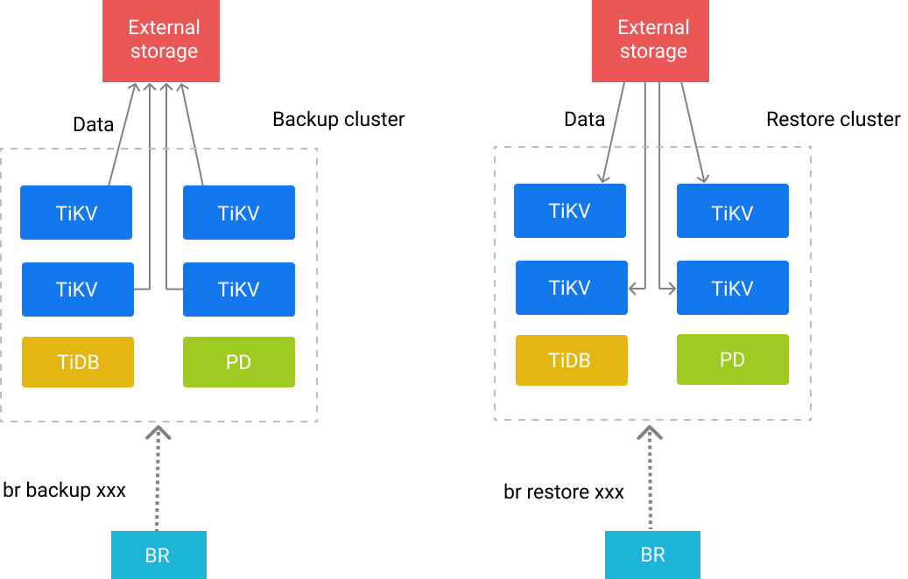

# TiDB 分布式备份恢复命令行工具BR

# 一、简介

[BR](https://github.com/pingcap/br) 全称为 Backup & Restore，是 TiDB **分布式备份恢复**的命令行工具，主要用于对 TiDB 集群进行数据备份和恢复。

相比 [`dumpling`](https://docs.pingcap.com/zh/tidb/stable/backup-and-restore-using-dumpling-lightning)，BR 更适合**大数据量**的场景。

# 二、工作原理

BR 将备份或恢复操作命令下发到各个 TiKV 节点。TiKV 收到命令后执行相应的备份或恢复操作。

在一次备份或恢复中，各个 TiKV 节点都会有一个对应的备份路径，TiKV 备份时产生的备份文件将会保存在该路径下，恢复时也会从该路径读取相应的备份文件。



# 三、备份文件类型

备份路径下会生成以下两种类型文件：

- SST 文件：存储 TiKV 备份下来的数据信息
- `backupmeta` 文件：存储本次备份的元信息，包括备份文件数、备份文件的 Key 区间、备份文件大小和备份文件 Hash (sha256) 值
- `backup.lock` 文件：用于防止多次备份到同一目录

### SST 文件命名格式

SST 文件以 `storeID_regionID_regionEpoch_keyHash_cf` 的格式命名。格式名的解释如下：

- storeID：TiKV 节点编号
- regionID：Region 编号
- regionEpoch：Region 版本号
- keyHash：Range startKey 的 Hash (sha256) 值，确保唯一性
- cf：RocksDB 的 ColumnFamily（默认为 `default` 或 `write`）

# 四、安装

## 1、推荐部署配置

- 推荐 BR 部署在 PD 节点上。
- 推荐使用一块高性能 SSD 网盘，挂载到 BR 节点和所有 TiKV 节点上，网盘推荐万兆网卡，否则带宽有可能成为备份恢复时的性能瓶颈。

## 2、安装

```bash
br_version=v4.0.8 && \
curl -s -# https://download.pingcap.org/tidb-toolkit-$br_version-linux-amd64.tar.gz | tar zxvf - -C /opt && \
ln -s /opt/tidb-toolkit-$br_version-linux-amd64/ /opt/tidb-toolkit && \
echo -e "export TIDB_TOOLKIT=/opt/tidb-toolkit\nexport PATH=\$PATH:\$TIDB_TOOLKIT/bin" >> /etc/profile && \
source /etc/profile
br --help
```

## 3、命令全局参数

```bash
全局参数:
      --ca string                       CA certificate path for TLS connection
      --cert string                     Certificate path for TLS connection
      --check-requirements              Whether start version check before execute command (default true)
      --checksum                        Run checksum at end of task (default true)
      --gcs.credentials-file string     (experimental) Set the GCS credentials file path
      --gcs.endpoint string             (experimental) Set the GCS endpoint URL
      --gcs.predefined-acl string       (experimental) Specify the GCS predefined acl for objects
      --gcs.storage-class string        (experimental) Specify the GCS storage class for objects
      --key string                      Private key path for TLS connection
      --log-file string                 Set the log file path. If not set, logs will output to temp file (default "/tmp/br.log.2021-04-20T17.02.38+0800")
      --log-format string               Set the log format (default "text")
  -L, --log-level string                Set the log level (default "info")
  -u, --pd strings                      PD address (default [127.0.0.1:2379])
      --ratelimit uint                  The rate limit of the task, MB/s per node
      --remove-tiflash                  Remove TiFlash replicas before backup or restore, for unsupported versions of TiFlash (default true)
      --s3.acl string                   (experimental) Set the S3 canned ACLs, e.g. authenticated-read
      --s3.endpoint string              (experimental) Set the S3 endpoint URL, please specify the http or https scheme explicitly
      --s3.provider string              (experimental) Set the S3 provider, e.g. aws, alibaba, ceph
      --s3.region string                (experimental) Set the S3 region, e.g. us-east-1
      --s3.sse string                   Set S3 server-side encryption, e.g. aws:kms
      --s3.sse-kms-key-id string        KMS CMK key id to use with S3 server-side encryption.Leave empty to use S3 owned key.
      --s3.storage-class string         (experimental) Set the S3 storage class, e.g. STANDARD
  -c, --send-credentials-to-tikv        Whether send credentials to tikv (default true)
      --status-addr string              Set the HTTP listening address for the status report service. Set to empty string to disable
  -s, --storage string                  specify the url where backup storage, eg, "s3://bucket/path/prefix"
      --switch-mode-interval duration   maintain import mode on TiKV during restore (default 5m0s)
```

# 五、备份

## 0、备份命令参数

```bash
命令格式
  br backup [子命令]

子命令:
  db          备份单个DB
  full        备份所有DB
  raw         (experimental) backup a raw kv range from TiKV cluster
  table       备份单个表

参数：
  --backupts string           the backup ts support TSO or datetime, 例如'400036290571534337', '2018-05-11 01:42:23'
  --compression string        sst文件压缩算法，可选: lz4|zstd(默认)|snappy
  --compression-level int32   sst文件压缩级别
  --gcttl int                 the TTL (in seconds) that PD holds for BR's GC safepoint (默认 300s)
  -h, --help                  help for backup
  --lastbackupts uint         (实验功能) the last time backup ts, use for incremental backup, support TSO only
  --timeago duration          The history version of the backup task, e.g. 1m, 1h. Do not exceed GCSafePoint
```

## 1、备份全部集群数据

```bash
br backup full \
    --pd "{PD1节点IP地址}:2379,{PD2节点IP地址}:2379" \
    --storage "local:///data/tidb-br-database-export" \
    --ratelimit 120 \
    --log-file backupfull.log
```

## 2、备份单个库

```bash
br backup db \
    --pd "${PDIP}:2379" \
    --db test \
    --storage "local:///tmp/backup" \
    --ratelimit 120 \
    --log-file backuptable.log
```

```bash
Detail BR log in /data/tidb-br-database-export/backupdb.log
Database backup <----------------------> 100.00%
Checksum <--------------------> 100.00%
[2021/04/20 21:15:10.704 +08:00] [INFO] [collector.go:60] ["Database backup Success summary: total backup ranges: 1317, total success: 1317, total failed: 0, total take(Database backup time): 7m58.135071495s, total take(real time): 11m30.059039886s, total kv: 2693175024, total size(MB): 397915.67, avg speed(MB/s): 832.22"] ["backup checksum"=3m28.860107739s] ["backup fast checksum"=593.123731ms] ["backup total regions"=7070] [BackupTS=424391166169710594] [Size=42165594435]

```


## 3、备份单个表

```bash
br backup table \
    --pd "${PDIP}:2379" \
    --db test \
    --table usertable \
    --storage "local:///tmp/backup" \
    --ratelimit 120 \
    --log-file backuptable.log
```

## 4、使用表库过滤功能备份多张表

```bash
br backup full \
    --pd "${PDIP}:2379" \
    --filter 'db*.tbl*' \
    --storage "local:///tmp/backup" \
    --ratelimit 120 \
    --log-file backupfull.log
```

## 5、增量备份

如果想要备份增量，只需要在备份的时候指定**上一次的备份时间戳** `--lastbackupts` 即可。

注意增量备份有以下限制：

- 增量备份需要与前一次全量备份在不同的路径下
- GC safepoint 必须在 `lastbackupts` 之前

```bash
br backup full\
    --pd ${PDIP}:2379 \
    -s local:///home/tidb/backupdata/incr \
    --lastbackupts ${LAST_BACKUP_TS}
```

以上命令会备份 `(LAST_BACKUP_TS, current PD timestamp]` 之间的增量数据。

你可以使用 `validate` 指令获取上一次备份的时间戳，示例如下：

```bash
LAST_BACKUP_TS=`br validate decode --field="end-version" -s local:///home/tidb/backupdata | tail -n1`
```

## 6、备份全部集群数据到 Amazon S3 后端存储

```bash
export AWS_ACCESS_KEY_ID=${AccessKey}
export AWS_SECRET_ACCESS_KEY=${SecretKey}
br backup full \
    --pd "${PDIP}:2379" \
    --storage "s3://${Bucket}/${Folder}" \
    --s3.region "${region}" \
    --send-credentials-to-tikv=true \
    --log-file backuptable.log
```

# 六、恢复


# 参考

1. https://docs.pingcap.com/zh/tidb/stable/backup-and-restore-tool